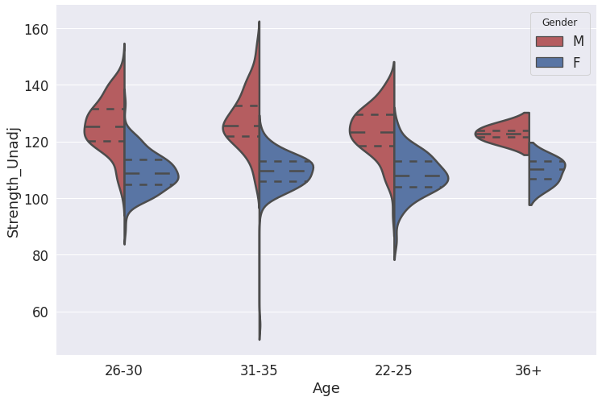

# So this week is all about using Python to conduct exploratory analysis (EDA). 

- [x] We will start by defining EDA
- [x] Then you will use pandas to generate basic and advance EDA summary tables
- [x] You will define your feature set 
- [x] And use Graphical EDA to form some intial assumptions about the data
- [x] Finnaly as a group you will create a notebook report and export it to pdf 

“A picture is worth more than ten thousand words” Chinese proverb

# Online assignment 

##  The online assignment is simple: 

- You will be separated into four groups (see next page)
- Each group gets to examine one  category from the following:
    -  Group A = "Alertness"
    -  Group B = "Cognition"
    -  Group C = "Emotion"
    -  Group D = "Personality"
- All you need to do is create a notebook report containing: 
    - A short introduction explaining the measures in your category  
    - Univariate EDA summary tables for all variables including the demographics 
    - Identify problems if exist across your data 
    - Univariate EDA plots for all variables
    - Focus on variables of interest 
    - Multi EDA sum

# group assignment 

|	Name	|	Group	|
|	:-:	|	:-:	|
|	Pietro Nickl	|	A	|
|	Hassan Bassam	|	A	|
|	Pat Chormai	|	A	|
|	Bojana Grujicic	|	B	|
|	Caedyn Stinson	|	B	|
|	Karla Matic	|	B	|
|	Carolin Scholl	|	B	|
|	Antonin Fourcade	|	C	|
|	Leonardo Pettini	|	C	|
|	Oliver Contier	|	C	|
|	Moritz Doerfler	|	D	|
|	Nina Coy	|	D	|
|	Rebekka Tenderra	|	D	|
|		|		|

# What is exploratory data analysis? 

- Exploratory data analysis (EDA) is a classical and under-utilized approach that helps you quickly build a relationship with the new data.
- The EDA method is simple; all you need to do is profile and summarise a datasets main characteristics. 
- The way data is summarised substantially directed by the type of data; however, in almost all cases, the idea is to identify what the properties of the data can tell us beyond narrow hypothesis testing.
- EDA was first advocated by John Tukey to encourage scientists to explore the data (without any prior assumptions), and identify interesting patterns or relationships that could lead to new data collection and experiments.

# Common first Steps in any EDA 

1. Identification of variables and data types
1. Create quantitative summary tables that describe the dataset. 
1. Use domain expertise to remove redundant information
1. Create distribution summary tables to understand the data further
1. Use Graphical univariate, bivariate and multivariate exploration to examine the data
1. Identify relationships of relevance that are worthy of exploring
1. Gain some domain expertise by writing a short description for each of these 

# Different data types (Numeric VS categorical variables)

1. Data comes in two primary flavours 
    1. Categorical 
    1. Numeric


# Different data types  - Categorical

- Categorical variables describe a characteristic of a data unit (i.e. ‘what type’ or ‘which category’). 
- Categorical variables are normally represented by a non-numeric value. 
- A categorical/nominal variable has two or more categories, 
- There is no intrinsic ordering to the classes.  
    - For example, sex is a categorical variable having two types (male and female) with no inherent order to the categories.  
    - In contrast, gender is a categorical variable having more than two groups depending on different criteria
    - Eye colour is also a categorical variable with several sub-types (blue, brown, green, red, etc.) 
- In Summary, any variable without internal ordering is categorical


# Different data types  - Ordinal

- An Ordinal variable has two or more categories with an explicit internal ordering.
    - For example, educational experience (none, primary, secondary, undergrad, postgrad, PhD).  
    - Importantly, the spacing between the values may not be the same across the levels of the variables. 
    - If we assign scores 1:6 to these educational levels, we would expect more substantial differences between the first categories than the last ones.
  

#  Different data types  -  Numeric

- Numeric/quantitative variables describe a measurable quantity in the dataset (i.e. 'how many' or 'how much'). 
- Numeric variables can be further divided as either discrete or continuous
    - Discrete numeric variable are simply integers 
        - A discrete variable cannot take the value of a fraction between one value and the next closest value. 
        - For example the number of correct response in a set of questions
    - A continuous numeric variable is defined using numbers represented with decimals (i.e. floats). 
        - It is typically either "every possible number" or "all the positive/negative numbers." 
        - For example response time is a strictly positive 
        - In contrast, "relative BOLD activation estimate" can be both positive and negative 


# Populations, samples and distributions

- When we examine data of any kind, it is essential to remember that we are working with a sample of data points from a wider population. 
- Most of the times, we want to understand something about the wider population. Studying the sample is a compromise.
- The problem with any sample that it is a ‘noisy’ reflection of the population. 
- EDA is all about exploring the current sample properties, and it is essential to remember that this may deviate from the broader population from which it is derived.
- To reduce the effects of this noise, it is good practice to perform EDA on only a subset of the data in hand. 


# univariate non-graphical simple descriptive tables 

- The first step in any EDA involves the calculation of summary statistics for the data set 
- Univariate methods look at one variable (data column) at a time
- Let's look at the Motor category from the hcp dataset as an example 

# We start by loading the data 

- We are using glob to find all the CSV files in the data directory
- Then we read both data sets as pandas data frames 


```
import numpy as np
import pandas as pd
pd.options.display.precision = 2
import os, glob
filelist = glob.glob(os.path.join("learning/course_2020/data/*/*.csv"))
df_dict = pd.read_csv(filelist[1], encoding = "ISO-8859-1")
df_hcp = pd.read_csv(filelist[0], encoding = "ISO-8859-1")
```

# Make a mask using isin method 

- We are using the hcp dictionary to create a logical mask for any row with either Motor or Subject Information
- As you can see this has True values for specific rows 


```
mask = df_dict.category.isin(["Motor","Subject Information"])
mask[1:10]
```


    1    True
    2    True
    3    True
    4    True
    5    True
    6    True
    7    True
    8    True
    9    True
    Name: category, dtype: bool


# Extract the relevant keys per category 

- Using the mask, we will extract all the relevant keys and place them in a list 


```
keys = list(df_dict.columnHeader[mask])
keys[1:10]
```


    ['Release',
     'Acquisition',
     'Gender',
     'Age',
     'Age',
     'Age',
     'Age_in_Yrs',
     'HasGT',
     'ZygositySR']


# Generate an index of columns in the hcp_data

- Using our keys, we intersect once again this time with the actual columns 


```
index = df_hcp.columns.isin(keys)
index[1:10]
```


    array([ True,  True,  True,  True, False, False, False, False, False])


# Finally we can create a subset of our df

- Using iloc we are slicing the original data frame and assigning it to a new variable 


```
sub_df = df_hcp.iloc[:,list(index)] 
sub_df.head()
```


<div>
<style scoped>
    .dataframe tbody tr th:only-of-type {
        vertical-align: middle;
    }

    .dataframe tbody tr th {
        vertical-align: top;
    }

    .dataframe thead th {
        text-align: right;
    }
</style>
<table border="1" class="dataframe">
  <thead>
    <tr style="text-align: right;">
      <th></th>
      <th>Subject</th>
      <th>Release</th>
      <th>Acquisition</th>
      <th>Gender</th>
      <th>Age</th>
      <th>Endurance_Unadj</th>
      <th>Endurance_AgeAdj</th>
      <th>GaitSpeed_Comp</th>
      <th>Dexterity_Unadj</th>
      <th>Dexterity_AgeAdj</th>
      <th>Strength_Unadj</th>
      <th>Strength_AgeAdj</th>
    </tr>
  </thead>
  <tbody>
    <tr>
      <th>0</th>
      <td>100004</td>
      <td>S900</td>
      <td>Q06</td>
      <td>M</td>
      <td>22-25</td>
      <td>122.02</td>
      <td>119.44</td>
      <td>1.31</td>
      <td>96.14</td>
      <td>83.77</td>
      <td>123.48</td>
      <td>119.30</td>
    </tr>
    <tr>
      <th>1</th>
      <td>100206</td>
      <td>S900</td>
      <td>Q11</td>
      <td>M</td>
      <td>26-30</td>
      <td>123.31</td>
      <td>121.27</td>
      <td>1.24</td>
      <td>106.61</td>
      <td>94.23</td>
      <td>132.46</td>
      <td>129.43</td>
    </tr>
    <tr>
      <th>2</th>
      <td>100307</td>
      <td>Q1</td>
      <td>Q01</td>
      <td>F</td>
      <td>26-30</td>
      <td>114.05</td>
      <td>111.10</td>
      <td>1.58</td>
      <td>118.68</td>
      <td>105.21</td>
      <td>108.34</td>
      <td>84.59</td>
    </tr>
    <tr>
      <th>3</th>
      <td>100408</td>
      <td>Q3</td>
      <td>Q03</td>
      <td>M</td>
      <td>31-35</td>
      <td>121.00</td>
      <td>121.80</td>
      <td>1.51</td>
      <td>117.48</td>
      <td>106.24</td>
      <td>125.18</td>
      <td>124.24</td>
    </tr>
    <tr>
      <th>4</th>
      <td>100610</td>
      <td>S900</td>
      <td>Q08</td>
      <td>M</td>
      <td>26-30</td>
      <td>107.24</td>
      <td>102.79</td>
      <td>1.10</td>
      <td>121.55</td>
      <td>107.85</td>
      <td>123.16</td>
      <td>118.90</td>
    </tr>
  </tbody>
</table>
</div>


# What is the shape of the data?

- Using shape, we identify the number of events and columns 


```
sub_df.shape
```


    (1206, 12)


# Sample 50% of the data fro exploration 

- We will now use the built-in function to subset the data frame in half 
- Start by setting a seed (for reproducibility)
- Explore different seeds to confirm that this works 


```
np.random.seed(1984)
sub_sub_df = sub_df.sample(frac=0.5)
sub_sub_df
```


<div>
<style scoped>
    .dataframe tbody tr th:only-of-type {
        vertical-align: middle;
    }

    .dataframe tbody tr th {
        vertical-align: top;
    }

    .dataframe thead th {
        text-align: right;
    }
</style>
<table border="1" class="dataframe">
  <thead>
    <tr style="text-align: right;">
      <th></th>
      <th>Subject</th>
      <th>Release</th>
      <th>Acquisition</th>
      <th>Gender</th>
      <th>Age</th>
      <th>Endurance_Unadj</th>
      <th>Endurance_AgeAdj</th>
      <th>GaitSpeed_Comp</th>
      <th>Dexterity_Unadj</th>
      <th>Dexterity_AgeAdj</th>
      <th>Strength_Unadj</th>
      <th>Strength_AgeAdj</th>
    </tr>
  </thead>
  <tbody>
    <tr>
      <th>325</th>
      <td>158843</td>
      <td>S900</td>
      <td>Q08</td>
      <td>M</td>
      <td>26-30</td>
      <td>109.79</td>
      <td>105.98</td>
      <td>1.27</td>
      <td>104.24</td>
      <td>91.88</td>
      <td>120.65</td>
      <td>113.56</td>
    </tr>
    <tr>
      <th>1119</th>
      <td>876873</td>
      <td>S900</td>
      <td>Q08</td>
      <td>F</td>
      <td>26-30</td>
      <td>99.93</td>
      <td>97.35</td>
      <td>1.32</td>
      <td>118.23</td>
      <td>107.14</td>
      <td>122.63</td>
      <td>120.74</td>
    </tr>
    <tr>
      <th>546</th>
      <td>201515</td>
      <td>S900</td>
      <td>Q09</td>
      <td>M</td>
      <td>26-30</td>
      <td>104.81</td>
      <td>100.36</td>
      <td>1.38</td>
      <td>106.53</td>
      <td>94.16</td>
      <td>114.97</td>
      <td>96.24</td>
    </tr>
    <tr>
      <th>153</th>
      <td>128329</td>
      <td>S500</td>
      <td>Q06</td>
      <td>F</td>
      <td>31-35</td>
      <td>93.22</td>
      <td>89.00</td>
      <td>1.49</td>
      <td>115.84</td>
      <td>105.06</td>
      <td>112.15</td>
      <td>95.38</td>
    </tr>
    <tr>
      <th>202</th>
      <td>136227</td>
      <td>S500</td>
      <td>Q07</td>
      <td>M</td>
      <td>31-35</td>
      <td>129.29</td>
      <td>130.13</td>
      <td>1.49</td>
      <td>101.16</td>
      <td>90.66</td>
      <td>124.77</td>
      <td>123.46</td>
    </tr>
    <tr>
      <th>...</th>
      <td>...</td>
      <td>...</td>
      <td>...</td>
      <td>...</td>
      <td>...</td>
      <td>...</td>
      <td>...</td>
      <td>...</td>
      <td>...</td>
      <td>...</td>
      <td>...</td>
      <td>...</td>
    </tr>
    <tr>
      <th>491</th>
      <td>192035</td>
      <td>S900</td>
      <td>Q07</td>
      <td>F</td>
      <td>26-30</td>
      <td>101.86</td>
      <td>99.94</td>
      <td>1.52</td>
      <td>148.67</td>
      <td>139.73</td>
      <td>115.09</td>
      <td>104.04</td>
    </tr>
    <tr>
      <th>973</th>
      <td>680250</td>
      <td>S900</td>
      <td>Q08</td>
      <td>F</td>
      <td>22-25</td>
      <td>111.75</td>
      <td>109.11</td>
      <td>1.23</td>
      <td>123.95</td>
      <td>109.61</td>
      <td>115.34</td>
      <td>97.22</td>
    </tr>
    <tr>
      <th>217</th>
      <td>138332</td>
      <td>S1200</td>
      <td>Q13</td>
      <td>M</td>
      <td>26-30</td>
      <td>117.53</td>
      <td>115.02</td>
      <td>1.27</td>
      <td>105.80</td>
      <td>93.36</td>
      <td>120.18</td>
      <td>112.50</td>
    </tr>
    <tr>
      <th>542</th>
      <td>200816</td>
      <td>S1200</td>
      <td>Q12</td>
      <td>F</td>
      <td>26-30</td>
      <td>91.41</td>
      <td>84.07</td>
      <td>0.93</td>
      <td>95.46</td>
      <td>82.97</td>
      <td>100.05</td>
      <td>72.14</td>
    </tr>
    <tr>
      <th>761</th>
      <td>393550</td>
      <td>S900</td>
      <td>Q08</td>
      <td>M</td>
      <td>26-30</td>
      <td>120.03</td>
      <td>118.03</td>
      <td>1.19</td>
      <td>106.20</td>
      <td>93.83</td>
      <td>117.71</td>
      <td>105.35</td>
    </tr>
  </tbody>
</table>
<p>603 rows × 12 columns</p>
</div>


# Let's extract information about our data frame 

- What we want to do is create a side table 
- Each row will contain summary scores capturing various information from the dataset 
- Let's start by confirming that pandas are encoding the datatypes correctly 


```
sub_sub_df.info()
```

    <class 'pandas.core.frame.DataFrame'>
    Int64Index: 603 entries, 325 to 761
    Data columns (total 12 columns):
     #   Column            Non-Null Count  Dtype  
    ---  ------            --------------  -----  
     0   Subject           603 non-null    int64  
     1   Release           603 non-null    object 
     2   Acquisition       603 non-null    object 
     3   Gender            603 non-null    object 
     4   Age               603 non-null    object 
     5   Endurance_Unadj   603 non-null    float64
     6   Endurance_AgeAdj  603 non-null    float64
     7   GaitSpeed_Comp    603 non-null    float64
     8   Dexterity_Unadj   603 non-null    float64
     9   Dexterity_AgeAdj  603 non-null    float64
     10  Strength_Unadj    602 non-null    float64
     11  Strength_AgeAdj   602 non-null    float64
    dtypes: float64(7), int64(1), object(4)
    memory usage: 61.2+ KB


# First Simple EDA Table from our data frame 

- We start by assessing the categorical variables using function describe 
- We transpose the table to generate a side view because what is primarily relevant in this stage  is the comparison within a metric


```
sum_cat = sub_sub_df.describe(include = 'object').T
sum_cat

```


<div>
<style scoped>
    .dataframe tbody tr th:only-of-type {
        vertical-align: middle;
    }

    .dataframe tbody tr th {
        vertical-align: top;
    }

    .dataframe thead th {
        text-align: right;
    }
</style>
<table border="1" class="dataframe">
  <thead>
    <tr style="text-align: right;">
      <th></th>
      <th>count</th>
      <th>unique</th>
      <th>top</th>
      <th>freq</th>
    </tr>
  </thead>
  <tbody>
    <tr>
      <th>Release</th>
      <td>603</td>
      <td>7</td>
      <td>S900</td>
      <td>222</td>
    </tr>
    <tr>
      <th>Acquisition</th>
      <td>603</td>
      <td>13</td>
      <td>Q11</td>
      <td>63</td>
    </tr>
    <tr>
      <th>Gender</th>
      <td>603</td>
      <td>2</td>
      <td>F</td>
      <td>337</td>
    </tr>
    <tr>
      <th>Age</th>
      <td>603</td>
      <td>4</td>
      <td>26-30</td>
      <td>251</td>
    </tr>
  </tbody>
</table>
</div>


# this is useful, however... 

- When exploring categorical variables, we would rather have a full frequency table 
- A simple tabulation of the frequency of each category is the best univariate non-graphical EDA for categorical data.
- This is simple enough to achieve using a function and several simple steps 

# Step one dummify the data 

- So this is a familiar concept across many different disciplines
- We are converting categorical variables to multidimensional binary space 
- We take a vector and transform it into a matrix where each class matches a column and occurrence of a class is binary codded 


```
dummy = pd.get_dummies(sub_sub_df["Gender"])
dummy.join(sub_sub_df["Gender"]).head()
```


<div>
<style scoped>
    .dataframe tbody tr th:only-of-type {
        vertical-align: middle;
    }

    .dataframe tbody tr th {
        vertical-align: top;
    }

    .dataframe thead th {
        text-align: right;
    }
</style>
<table border="1" class="dataframe">
  <thead>
    <tr style="text-align: right;">
      <th></th>
      <th>F</th>
      <th>M</th>
      <th>Gender</th>
    </tr>
  </thead>
  <tbody>
    <tr>
      <th>325</th>
      <td>0</td>
      <td>1</td>
      <td>M</td>
    </tr>
    <tr>
      <th>1119</th>
      <td>1</td>
      <td>0</td>
      <td>F</td>
    </tr>
    <tr>
      <th>546</th>
      <td>0</td>
      <td>1</td>
      <td>M</td>
    </tr>
    <tr>
      <th>153</th>
      <td>1</td>
      <td>0</td>
      <td>F</td>
    </tr>
    <tr>
      <th>202</th>
      <td>0</td>
      <td>1</td>
      <td>M</td>
    </tr>
  </tbody>
</table>
</div>


# Sum the dummy to get counts 

- If each event is represented as one binary value then summing each column will give us the count per class 


```
Count = np.sum(dummy)
Count.head()
```


    F    337
    M    266
    dtype: int64


# What about Proportion?

- Proportion is the relative frequency and is defined as Count divided by total 


```
Proportion = Count/np.sum(Count)
Proportion.head()
```


    F    0.56
    M    0.44
    dtype: float64


# And Percentage?

- The percentage is just Proportion multiplied by 100


```
Percent = Proportion*100
Percent.head()
```


    F    55.89
    M    44.11
    dtype: float64


# lets combine these to one summary table 

- To make this useful, we would ideally have this as a pandas data frame 
- Furthermore, it is easier to have this as a wide/side table rather than a long one 
- Remember the objective is to compare the classes in each metric 


```
df = pd.DataFrame({"Count":Count,"Proportion":Proportion,"Percent":Percent}).T
display(df)
```


<div>
<style scoped>
    .dataframe tbody tr th:only-of-type {
        vertical-align: middle;
    }

    .dataframe tbody tr th {
        vertical-align: top;
    }

    .dataframe thead th {
        text-align: right;
    }
</style>
<table border="1" class="dataframe">
  <thead>
    <tr style="text-align: right;">
      <th></th>
      <th>F</th>
      <th>M</th>
    </tr>
  </thead>
  <tbody>
    <tr>
      <th>Count</th>
      <td>337.00</td>
      <td>266.00</td>
    </tr>
    <tr>
      <th>Proportion</th>
      <td>0.56</td>
      <td>0.44</td>
    </tr>
    <tr>
      <th>Percent</th>
      <td>55.89</td>
      <td>44.11</td>
    </tr>
  </tbody>
</table>
</div>


# We should also add a total column
- We can just sum these values to get the total 
- Unless we have some missing values, these should sum up to 1 and 100% 


```
df['Total'] =  [np.sum(Count),np.sum(Proportion),np.sum(Percent)]
df
```


<div>
<style scoped>
    .dataframe tbody tr th:only-of-type {
        vertical-align: middle;
    }

    .dataframe tbody tr th {
        vertical-align: top;
    }

    .dataframe thead th {
        text-align: right;
    }
</style>
<table border="1" class="dataframe">
  <thead>
    <tr style="text-align: right;">
      <th></th>
      <th>F</th>
      <th>M</th>
      <th>Total</th>
    </tr>
  </thead>
  <tbody>
    <tr>
      <th>Count</th>
      <td>337.00</td>
      <td>266.00</td>
      <td>603.0</td>
    </tr>
    <tr>
      <th>Proportion</th>
      <td>0.56</td>
      <td>0.44</td>
      <td>1.0</td>
    </tr>
    <tr>
      <th>Percent</th>
      <td>55.89</td>
      <td>44.11</td>
      <td>100.0</td>
    </tr>
  </tbody>
</table>
</div>


# lets make this into a function 

- This can now be generalised to any column


```
def freq(x):
    dummy =  pd.get_dummies(x)
    Count = np.sum(dummy)
    Proportion = Count/np.sum(Count)
    Percent = Proportion*100
    df = pd.DataFrame({"Count":Count,"Proportion":Proportion,"Percent":Percent}).T
    df['Total'] =  [np.sum(Count),np.sum(Proportion),np.sum(Percent)]
    df.columns.name = x.name
    return df
```

# Now lets use our function 
- We can use a loop to explore the different variables


```
for cat in sum_cat.index:
    display(freq(sub_sub_df[cat]))
```


<div>
<style scoped>
    .dataframe tbody tr th:only-of-type {
        vertical-align: middle;
    }

    .dataframe tbody tr th {
        vertical-align: top;
    }

    .dataframe thead th {
        text-align: right;
    }
</style>
<table border="1" class="dataframe">
  <thead>
    <tr style="text-align: right;">
      <th>Release</th>
      <th>MEG2</th>
      <th>Q1</th>
      <th>Q2</th>
      <th>Q3</th>
      <th>S1200</th>
      <th>S500</th>
      <th>S900</th>
      <th>Total</th>
    </tr>
  </thead>
  <tbody>
    <tr>
      <th>Count</th>
      <td>7.00</td>
      <td>41.00</td>
      <td>36.00</td>
      <td>50.00</td>
      <td>112.00</td>
      <td>135.00</td>
      <td>222.00</td>
      <td>603.0</td>
    </tr>
    <tr>
      <th>Proportion</th>
      <td>0.01</td>
      <td>0.07</td>
      <td>0.06</td>
      <td>0.08</td>
      <td>0.19</td>
      <td>0.22</td>
      <td>0.37</td>
      <td>1.0</td>
    </tr>
    <tr>
      <th>Percent</th>
      <td>1.16</td>
      <td>6.80</td>
      <td>5.97</td>
      <td>8.29</td>
      <td>18.57</td>
      <td>22.39</td>
      <td>36.82</td>
      <td>100.0</td>
    </tr>
  </tbody>
</table>
</div>


<div>
<style scoped>
    .dataframe tbody tr th:only-of-type {
        vertical-align: middle;
    }

    .dataframe tbody tr th {
        vertical-align: top;
    }

    .dataframe thead th {
        text-align: right;
    }
</style>
<table border="1" class="dataframe">
  <thead>
    <tr style="text-align: right;">
      <th>Acquisition</th>
      <th>Q01</th>
      <th>Q02</th>
      <th>Q03</th>
      <th>Q04</th>
      <th>Q05</th>
      <th>Q06</th>
      <th>Q07</th>
      <th>Q08</th>
      <th>Q09</th>
      <th>Q10</th>
      <th>Q11</th>
      <th>Q12</th>
      <th>Q13</th>
      <th>Total</th>
    </tr>
  </thead>
  <tbody>
    <tr>
      <th>Count</th>
      <td>29.00</td>
      <td>43.00</td>
      <td>50.00</td>
      <td>58.00</td>
      <td>44.00</td>
      <td>53.00</td>
      <td>40.00</td>
      <td>51.00</td>
      <td>44.00</td>
      <td>43.00</td>
      <td>63.00</td>
      <td>52.00</td>
      <td>33.00</td>
      <td>603.0</td>
    </tr>
    <tr>
      <th>Proportion</th>
      <td>0.05</td>
      <td>0.07</td>
      <td>0.08</td>
      <td>0.10</td>
      <td>0.07</td>
      <td>0.09</td>
      <td>0.07</td>
      <td>0.08</td>
      <td>0.07</td>
      <td>0.07</td>
      <td>0.10</td>
      <td>0.09</td>
      <td>0.05</td>
      <td>1.0</td>
    </tr>
    <tr>
      <th>Percent</th>
      <td>4.81</td>
      <td>7.13</td>
      <td>8.29</td>
      <td>9.62</td>
      <td>7.30</td>
      <td>8.79</td>
      <td>6.63</td>
      <td>8.46</td>
      <td>7.30</td>
      <td>7.13</td>
      <td>10.45</td>
      <td>8.62</td>
      <td>5.47</td>
      <td>100.0</td>
    </tr>
  </tbody>
</table>
</div>


<div>
<style scoped>
    .dataframe tbody tr th:only-of-type {
        vertical-align: middle;
    }

    .dataframe tbody tr th {
        vertical-align: top;
    }

    .dataframe thead th {
        text-align: right;
    }
</style>
<table border="1" class="dataframe">
  <thead>
    <tr style="text-align: right;">
      <th>Gender</th>
      <th>F</th>
      <th>M</th>
      <th>Total</th>
    </tr>
  </thead>
  <tbody>
    <tr>
      <th>Count</th>
      <td>337.00</td>
      <td>266.00</td>
      <td>603.0</td>
    </tr>
    <tr>
      <th>Proportion</th>
      <td>0.56</td>
      <td>0.44</td>
      <td>1.0</td>
    </tr>
    <tr>
      <th>Percent</th>
      <td>55.89</td>
      <td>44.11</td>
      <td>100.0</td>
    </tr>
  </tbody>
</table>
</div>


<div>
<style scoped>
    .dataframe tbody tr th:only-of-type {
        vertical-align: middle;
    }

    .dataframe tbody tr th {
        vertical-align: top;
    }

    .dataframe thead th {
        text-align: right;
    }
</style>
<table border="1" class="dataframe">
  <thead>
    <tr style="text-align: right;">
      <th>Age</th>
      <th>22-25</th>
      <th>26-30</th>
      <th>31-35</th>
      <th>36+</th>
      <th>Total</th>
    </tr>
  </thead>
  <tbody>
    <tr>
      <th>Count</th>
      <td>132.00</td>
      <td>251.00</td>
      <td>214.00</td>
      <td>6.00e+00</td>
      <td>603.0</td>
    </tr>
    <tr>
      <th>Proportion</th>
      <td>0.22</td>
      <td>0.42</td>
      <td>0.35</td>
      <td>9.95e-03</td>
      <td>1.0</td>
    </tr>
    <tr>
      <th>Percent</th>
      <td>21.89</td>
      <td>41.63</td>
      <td>35.49</td>
      <td>9.95e-01</td>
      <td>100.0</td>
    </tr>
  </tbody>
</table>
</div>


# what about quantitative data Characteristics?
- Univariate EDA examins the distribution of the observed sample.
- The characteristics of the quantitative distribution are called the sample statistics 
- These aim to approximate some properties of the actual distribution


# using describe on Numeric data 

- Using the same function (i.e. describe) on quantitative variables will generate a different summary table


```
sum_quan = sub_sub_df.describe(include = 'float').T
display(sum_quan)

```


<div>
<style scoped>
    .dataframe tbody tr th:only-of-type {
        vertical-align: middle;
    }

    .dataframe tbody tr th {
        vertical-align: top;
    }

    .dataframe thead th {
        text-align: right;
    }
</style>
<table border="1" class="dataframe">
  <thead>
    <tr style="text-align: right;">
      <th></th>
      <th>count</th>
      <th>mean</th>
      <th>std</th>
      <th>min</th>
      <th>25%</th>
      <th>50%</th>
      <th>75%</th>
      <th>max</th>
    </tr>
  </thead>
  <tbody>
    <tr>
      <th>Endurance_Unadj</th>
      <td>603.0</td>
      <td>109.43</td>
      <td>12.03</td>
      <td>80.32</td>
      <td>101.59</td>
      <td>108.20</td>
      <td>116.94</td>
      <td>145.10</td>
    </tr>
    <tr>
      <th>Endurance_AgeAdj</th>
      <td>603.0</td>
      <td>106.94</td>
      <td>14.09</td>
      <td>70.39</td>
      <td>97.58</td>
      <td>105.80</td>
      <td>116.15</td>
      <td>145.51</td>
    </tr>
    <tr>
      <th>GaitSpeed_Comp</th>
      <td>603.0</td>
      <td>1.31</td>
      <td>0.19</td>
      <td>0.79</td>
      <td>1.17</td>
      <td>1.31</td>
      <td>1.44</td>
      <td>1.94</td>
    </tr>
    <tr>
      <th>Dexterity_Unadj</th>
      <td>603.0</td>
      <td>111.96</td>
      <td>10.88</td>
      <td>81.53</td>
      <td>104.60</td>
      <td>111.65</td>
      <td>120.22</td>
      <td>148.67</td>
    </tr>
    <tr>
      <th>Dexterity_AgeAdj</th>
      <td>603.0</td>
      <td>99.72</td>
      <td>10.11</td>
      <td>67.55</td>
      <td>92.97</td>
      <td>99.93</td>
      <td>107.41</td>
      <td>139.73</td>
    </tr>
    <tr>
      <th>Strength_Unadj</th>
      <td>602.0</td>
      <td>116.32</td>
      <td>11.55</td>
      <td>55.29</td>
      <td>107.43</td>
      <td>114.38</td>
      <td>123.78</td>
      <td>154.01</td>
    </tr>
    <tr>
      <th>Strength_AgeAdj</th>
      <td>602.0</td>
      <td>102.98</td>
      <td>20.45</td>
      <td>45.41</td>
      <td>85.47</td>
      <td>98.85</td>
      <td>121.40</td>
      <td>154.59</td>
    </tr>
  </tbody>
</table>
</div>


# describe covers precision

- Count gives us some idea on the precision of the data set 
- The more samples you have, the more precise your estimates are 
- However, this is related to variability 
- e.g. many identical samples will not be helpful


# describe also covers centrality

- The mean and the median (i.e. 50% quartile) are indicators of location or the cnter of the distribution
- However, there are other measures of centrality... for example: 
    - Geometric = 
    $ \left(\prod _{i=1}^{n}x_{i}\right)^{\frac {1}{n}}={\sqrt[{n}]{x_{1}x_{2}\cdots x_{n}}} $
    - Truncated or trimmed mean removing values above or below some precatage  


# The geometric mean 

- It is more straightforward to understand this as a function
- The geometric mean is defined as the nth root of the product of n numbers
- However, if we try to calculate the product of many numbers we reach the limits of our computer to describe large numbers 


```
result = 1
for ix,num in enumerate(sub_sub_df.Dexterity_AgeAdj):
    result = result * num
    if not ix%50:
        print(f'{ix}:{result}')


```

    0:91.88
    50:2.0537497919595477e+101
    100:3.130700885224843e+201
    150:6.174733748515891e+300
    200:inf
    250:inf
    300:inf
    350:inf
    400:inf
    450:inf
    500:inf
    550:inf
    600:inf


# Dealing with inf using log 

- The solution is to take the mean of the log-transformed data
- And use np.exp to convert back from logarithmic to linear scale 


```
def geometric(x):
    return np.exp(np.log(x).mean())
```

# The Truncated mean as another example 

- The idea here is to measure centrality using only a middle portion of the distribution 
- This is done to reduce the effects of long tails 
- This involves trimming percentage of observations from both ends.
- We get the number of observation from the series shape 
- Calculate the number of events to remove from both side 
- Then using a sorted list, we calculated the mean on a subset of the data


```
def truncated(x, percent_trimmed):
    n = x.shape[0]
    lower_index = int(percent_trimmed*n/100)
    upper_index = n - lower_index
    return np.sort(x)[lower_index:upper_index].mean()

```

# describe also covers spread with some help 

- Measuring the spread of a distribution commonly depends on spread statistics such as variance, standard deviation, and interquartile range.
- The standard deviation is simply the square root of the variance. This means it is in the same units as the original data, which makes it a useful measure. 
- Normally distributed data, approximately 95% of the values lie within 2 sd of the mean.
- The interquartile range is the difference between the third quartile (75%) and the first quartile (25%)


```
def eda(x):
    Min,Q1,Median,Q3,Max =  np.nanquantile(x,[0,0.25,0.5,0.75,1])
    obj = {
        "n":x.shape[0],
        "NaN":x.isna().sum(),
        "Min":Min,
        "Q1":Q1,
        "Median":Median,
        "Mean":np.mean(x),
        "Q3":Q3,
        "Max":Max,
        "IQR":Q3-Q1,
        "STD":np.std(x)
     }
    df = pd.DataFrame(obj, index=[x.name])
    return df

eda(sub_sub_df.Dexterity_AgeAdj)
```


<div>
<style scoped>
    .dataframe tbody tr th:only-of-type {
        vertical-align: middle;
    }

    .dataframe tbody tr th {
        vertical-align: top;
    }

    .dataframe thead th {
        text-align: right;
    }
</style>
<table border="1" class="dataframe">
  <thead>
    <tr style="text-align: right;">
      <th></th>
      <th>n</th>
      <th>NaN</th>
      <th>Min</th>
      <th>Q1</th>
      <th>Median</th>
      <th>Mean</th>
      <th>Q3</th>
      <th>Max</th>
      <th>IQR</th>
      <th>STD</th>
    </tr>
  </thead>
  <tbody>
    <tr>
      <th>Dexterity_AgeAdj</th>
      <td>603</td>
      <td>0</td>
      <td>67.55</td>
      <td>92.97</td>
      <td>99.93</td>
      <td>99.72</td>
      <td>107.41</td>
      <td>139.73</td>
      <td>14.44</td>
      <td>10.1</td>
    </tr>
  </tbody>
</table>
</div>


# We only need shape information 

- Skewness is a measure of asymmetry.
- Kurtosis is a measure of how pointy the distribution is relative to a Gaussian shape
- Let's add these to our EDA table we will understand them after we cover graphical EDA 
- Last thing we want to count the number of unique non-NA values
- This can be considered a measure of the heterogeneity of the data


# Final EDA summary table 


```
def eda(x):
    Min,Q1,Median,Q3,Max =  np.nanquantile(x,[0,0.25,0.5,0.75,1])
    obj = {
        "n":x.shape[0],
        "NaN":x.isna().sum(),
        "Min":Min,
        "Q1":Q1,
        "Median":Median,
        "Mean":np.mean(x),
        "Q3":Q3,
        "Max":Max,
        "IQR":Q3-Q1,
        "STD":np.std(x),
        "SE":np.std(x)/np.sqrt(x.shape[0]),
        "Skewness":pd.Series.skew(x),
        "Kurtosis":pd.Series.kurtosis(x),
        "nunique":pd.Series.nunique(x)
     }
    df = pd.DataFrame(obj, index=[x.name])
    return df

eda(sub_sub_df.Dexterity_AgeAdj)
```


<div>
<style scoped>
    .dataframe tbody tr th:only-of-type {
        vertical-align: middle;
    }

    .dataframe tbody tr th {
        vertical-align: top;
    }

    .dataframe thead th {
        text-align: right;
    }
</style>
<table border="1" class="dataframe">
  <thead>
    <tr style="text-align: right;">
      <th></th>
      <th>n</th>
      <th>NaN</th>
      <th>Min</th>
      <th>Q1</th>
      <th>Median</th>
      <th>Mean</th>
      <th>Q3</th>
      <th>Max</th>
      <th>IQR</th>
      <th>STD</th>
      <th>SE</th>
      <th>Skewness</th>
      <th>Kurtosis</th>
      <th>nunique</th>
    </tr>
  </thead>
  <tbody>
    <tr>
      <th>Dexterity_AgeAdj</th>
      <td>603</td>
      <td>0</td>
      <td>67.55</td>
      <td>92.97</td>
      <td>99.93</td>
      <td>99.72</td>
      <td>107.41</td>
      <td>139.73</td>
      <td>14.44</td>
      <td>10.1</td>
      <td>0.41</td>
      <td>-0.12</td>
      <td>-0.04</td>
      <td>430</td>
    </tr>
  </tbody>
</table>
</div>


# My decent quantitive EDA table 

- So this is a simple but effective approach to examine different parts of your data and gain a feel of it 


```
df = pd.DataFrame()
for cat in sum_quan.index:
    df = df.append(eda(sub_sub_df[cat]))
df

```


<div>
<style scoped>
    .dataframe tbody tr th:only-of-type {
        vertical-align: middle;
    }

    .dataframe tbody tr th {
        vertical-align: top;
    }

    .dataframe thead th {
        text-align: right;
    }
</style>
<table border="1" class="dataframe">
  <thead>
    <tr style="text-align: right;">
      <th></th>
      <th>n</th>
      <th>NaN</th>
      <th>Min</th>
      <th>Q1</th>
      <th>Median</th>
      <th>Mean</th>
      <th>Q3</th>
      <th>Max</th>
      <th>IQR</th>
      <th>STD</th>
      <th>SE</th>
      <th>Skewness</th>
      <th>Kurtosis</th>
      <th>nunique</th>
    </tr>
  </thead>
  <tbody>
    <tr>
      <th>Endurance_Unadj</th>
      <td>603</td>
      <td>0</td>
      <td>80.32</td>
      <td>101.59</td>
      <td>108.20</td>
      <td>109.43</td>
      <td>116.94</td>
      <td>145.10</td>
      <td>15.34</td>
      <td>12.02</td>
      <td>4.89e-01</td>
      <td>0.27</td>
      <td>-0.11</td>
      <td>474</td>
    </tr>
    <tr>
      <th>Endurance_AgeAdj</th>
      <td>603</td>
      <td>0</td>
      <td>70.39</td>
      <td>97.58</td>
      <td>105.80</td>
      <td>106.94</td>
      <td>116.15</td>
      <td>145.51</td>
      <td>18.57</td>
      <td>14.08</td>
      <td>5.73e-01</td>
      <td>0.07</td>
      <td>-0.22</td>
      <td>502</td>
    </tr>
    <tr>
      <th>GaitSpeed_Comp</th>
      <td>603</td>
      <td>0</td>
      <td>0.79</td>
      <td>1.17</td>
      <td>1.31</td>
      <td>1.31</td>
      <td>1.44</td>
      <td>1.94</td>
      <td>0.27</td>
      <td>0.19</td>
      <td>7.91e-03</td>
      <td>0.34</td>
      <td>0.05</td>
      <td>91</td>
    </tr>
    <tr>
      <th>Dexterity_Unadj</th>
      <td>603</td>
      <td>0</td>
      <td>81.53</td>
      <td>104.60</td>
      <td>111.65</td>
      <td>111.96</td>
      <td>120.22</td>
      <td>148.67</td>
      <td>15.62</td>
      <td>10.87</td>
      <td>4.43e-01</td>
      <td>0.13</td>
      <td>-0.24</td>
      <td>346</td>
    </tr>
    <tr>
      <th>Dexterity_AgeAdj</th>
      <td>603</td>
      <td>0</td>
      <td>67.55</td>
      <td>92.97</td>
      <td>99.93</td>
      <td>99.72</td>
      <td>107.41</td>
      <td>139.73</td>
      <td>14.44</td>
      <td>10.10</td>
      <td>4.11e-01</td>
      <td>-0.12</td>
      <td>-0.04</td>
      <td>430</td>
    </tr>
    <tr>
      <th>Strength_Unadj</th>
      <td>603</td>
      <td>1</td>
      <td>55.29</td>
      <td>107.43</td>
      <td>114.38</td>
      <td>116.32</td>
      <td>123.78</td>
      <td>154.01</td>
      <td>16.35</td>
      <td>11.54</td>
      <td>4.70e-01</td>
      <td>0.23</td>
      <td>0.87</td>
      <td>437</td>
    </tr>
    <tr>
      <th>Strength_AgeAdj</th>
      <td>603</td>
      <td>1</td>
      <td>45.41</td>
      <td>85.47</td>
      <td>98.85</td>
      <td>102.98</td>
      <td>121.40</td>
      <td>154.59</td>
      <td>35.93</td>
      <td>20.44</td>
      <td>8.32e-01</td>
      <td>0.19</td>
      <td>-1.01</td>
      <td>515</td>
    </tr>
  </tbody>
</table>
</div>


# Univariate categorical graphical EDA

- We are going to use Matplotlib and pandas plotting capabilities 
- However, you can use any packages you want (there are at least seven excellent plotting packages I know of and if you prefer to use them be my guest)

# Pie charts 

- We will start by examining the frequency of the categorical variables using pie charts 
- This is just a visual representation of the tables we produced before 


```
import matplotlib
import matplotlib.pyplot as plt
import matplotlib.gridspec as gridspec
plt.style.use('ggplot')

fig, ax = plt.subplots(1, 4,figsize=(16,5))

for ix,cat in enumerate(sum_cat.index):
    ax[ix].pie(sub_sub_df[cat].value_counts()/sub_sub_df.shape[0],labels=np.unique(sub_sub_df[cat]))
    ax[ix].set_title(cat)
```


# Histograms

- The most basic graph is the histogram, which is a barplot in which each bar represents the frequency (count) or proportion (count/total count) of cases for a range of values.


```
fig = plt.figure(constrained_layout=True,figsize=(16,8))
gs = gridspec.GridSpec(ncols=3, nrows=3, figure=fig)
for ix,cat in enumerate(sum_quan.index):
    i,j = np.unravel_index(ix, (3,3))
    ax = fig.add_subplot(gs[i,j])
    ax.hist(sub_sub_df[cat].dropna(),20)
    plt.ylabel("count")
    plt.xlabel(cat)

```


# Boxplots

- Another handy univariate graphical technique is the boxplot
- Boxplots are very good at presenting information about the central tendency, symmetry and skew, as well as outliers.
- However, as you can see they aren't great at detecting multimodal distributions 
- Boxplots show robust measures of location and spread as well as providing information about symmetry and outliers.


```
fig = plt.figure(constrained_layout=True,figsize=(16,8))
gs = gridspec.GridSpec(ncols=7, nrows=1, figure=fig)
for ix,cat in enumerate(sum_quan.index):
    ax = fig.add_subplot(gs[ix])
    ax.boxplot(sub_sub_df[cat].dropna(),patch_artist=True,boxprops={"facecolor":'r', "color":'r'})
    plt.ylabel(cat)

```


# Quantile-normal plots 

- The quantile-normal or qqplot is both the last univariate tool we will cover and an intro to the bivariate graphical EDA plots 
- The idea is to match our sample with the theoretical normal distribution 
- If the data is normal, then all data points should be aligned close to the red line 
- Deviation from that line is evidence of abnormality 
- We will explore these next week when we will talk about dealing with abnormal data 


```
import statsmodels.api as sm

fig = plt.figure(constrained_layout=True,figsize=(12,8))
gs = gridspec.GridSpec(ncols=4, nrows=2, figure=fig)
for ix,cat in enumerate(sum_quan.index):
    i,j = np.unravel_index(ix, (2,4))
    ax = fig.add_subplot(gs[i,j])
    sm.qqplot(sub_sub_df[cat].dropna(), line='s',ax=ax)
    plt.title(cat)


```


# Now let's explore Multivariate non-graphical EDA tables

- These methods can become rather complicated (with large multi-dimensional datasets) 
- The gist is to examine various metrics as a function of some structure 

# Cross-tabulation

- Used to cross inspect frequency across two or more categorical variables.


```
pd.crosstab(sub_sub_df.Gender, [sub_sub_df.Age], rownames=['Gender'], colnames=['Age'])
```


<div>
<style scoped>
    .dataframe tbody tr th:only-of-type {
        vertical-align: middle;
    }

    .dataframe tbody tr th {
        vertical-align: top;
    }

    .dataframe thead th {
        text-align: right;
    }
</style>
<table border="1" class="dataframe">
  <thead>
    <tr style="text-align: right;">
      <th>Age</th>
      <th>22-25</th>
      <th>26-30</th>
      <th>31-35</th>
      <th>36+</th>
    </tr>
    <tr>
      <th>Gender</th>
      <th></th>
      <th></th>
      <th></th>
      <th></th>
    </tr>
  </thead>
  <tbody>
    <tr>
      <th>F</th>
      <td>52</td>
      <td>141</td>
      <td>140</td>
      <td>4</td>
    </tr>
    <tr>
      <th>M</th>
      <td>80</td>
      <td>110</td>
      <td>74</td>
      <td>2</td>
    </tr>
  </tbody>
</table>
</div>


# pivot_table

- A pivot table is a way to explore summary statistics as a function of different categorical structures of interest
- It is a combination between univariate EDA tables and cross-tabulation


```
pivot1 = pd.pivot_table(sub_sub_df.dropna(),
                        values=['Endurance_AgeAdj',"Strength_AgeAdj"], 
                        index='Age', columns=['Gender'],
                        aggfunc=['mean','std','count'])
```

# Cross-Correlation
- Correlation is probably one of the most used metrics in the world 
- We can view it for now as a measure of similarity/association between variables 


```
display(sub_sub_df[['Endurance_Unadj',"Strength_Unadj","GaitSpeed_Comp","Dexterity_Unadj"]].dropna().corr())
```


<div>
<style scoped>
    .dataframe tbody tr th:only-of-type {
        vertical-align: middle;
    }

    .dataframe tbody tr th {
        vertical-align: top;
    }

    .dataframe thead th {
        text-align: right;
    }
</style>
<table border="1" class="dataframe">
  <thead>
    <tr style="text-align: right;">
      <th></th>
      <th>Endurance_Unadj</th>
      <th>Strength_Unadj</th>
      <th>GaitSpeed_Comp</th>
      <th>Dexterity_Unadj</th>
    </tr>
  </thead>
  <tbody>
    <tr>
      <th>Endurance_Unadj</th>
      <td>1.00</td>
      <td>0.26</td>
      <td>0.24</td>
      <td>0.14</td>
    </tr>
    <tr>
      <th>Strength_Unadj</th>
      <td>0.26</td>
      <td>1.00</td>
      <td>0.02</td>
      <td>-0.18</td>
    </tr>
    <tr>
      <th>GaitSpeed_Comp</th>
      <td>0.24</td>
      <td>0.02</td>
      <td>1.00</td>
      <td>0.08</td>
    </tr>
    <tr>
      <th>Dexterity_Unadj</th>
      <td>0.14</td>
      <td>-0.18</td>
      <td>0.08</td>
      <td>1.00</td>
    </tr>
  </tbody>
</table>
</div>


# Multivariate graphical EDA

- For this, I will use seaborn just because it is built for this kind of things 
- The violin plot is a distribution plot where some method is used to estimate from the data the distribution shape 
- As you can see the bimodal distribution we saw previously is entirely explained by the gender information 


```
import seaborn as sns
sns.set(style="darkgrid", palette="deep", color_codes=True)
sns.set_context("notebook", font_scale=1.5, rc={"lines.linewidth": 2.5})
fig = plt.figure(figsize=(12,8))
sns.violinplot(x="Age", y="Strength_Unadj", hue="Gender",
               split=True, inner="quart",
               palette={"M": "r", "F": "b"},
               data=sub_sub_df)
sns.despine(left=True)

```





# Summary 

- Next week we will cover more ways to understand our data 


# why are some empty

- As you can see there are some diffrences between numbers in  dict_rows and hcp_cols
- The reason is that some of the data is sensative, and requires special permisson to share with you
- For our needs the unrestricted data set is more than fine
- However, access to the rest of the data is possible it just requires you to [sign a concent form](https://www.humanconnectome.org/study/hcp-young-adult/document/wu-minn-hcp-consortium-open-access-data-use-terms) with some legal responsibility on me (which I wans't eager to take upon)
